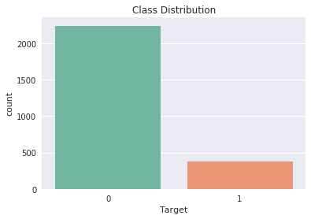

# predict-advertisement

## Overview

Aim is to classify images as **Ad** (Advertisement) and **Non-Ad** (Not Advertisement). Given samples in the training set are 2623 and features are 1559. There are three continuos features which are height, width and aspect ratio of the image, where as other variables are categorical. Below is the structure of the project
```
predict-advertisement/
├── data
│   ├── column_names.txt
│   ├── documentation.txt
│   ├── test.csv                            <-- train file
│   └── training.csv                        <-- test file
├── plots
│   ├── best_cm.png
│   ├── cv_results.png
│   ├── distplot.png
│   └── tgt_dist.png
├── predict-advertisement.ipynb            <-- iPython Notebook of the project
├── predict-advertisement.py               <-- Equivalent python file of the project
├── README.md
└── test_predicted.csv                     <-- predicted test file
```


## Methodology

### Preprocessing the Data
1. Replacing **Ad** = 1 and **Non-Ad** = 0 in the Target Column
2. Afetr visualizing the head of the dataset we realize that there are missing values.Replacing all the missing values first as `np.NaN` then observing the distribution of the columns to check for skewness. Below is the distribution


From the above image we can see that the data is right skewed. So, now we have to replace the missing values using *'median'* instead of *'mean'* as the central tendency.

3. Checking for target distribution to understand the overall spread.


We can see that 80% of the data is Non-Ad and just 20% of the data is Ad. There is high class imbalance seen, which could later result to poor performance of the model.

## Training the Model
Since it is a classification model, we first try with popular machine learning classification algorithms such as - 
1. Naive Bayes
2. SVM - Support Vector Machines
3. Logistic Regression
4. K-Nearest Neighbours
5. Random Forests

## Evaluating the Model
Since it is a classification model, we have to choose our evaluation metric properly as the measure of accuracy can be deceiving. So for the all the models we observe the `classification report`, which includes the metrics precision, recall, f1-score. Apart from that, we would also visualize the coonfusion matrix.

To view the results of the individual model, please view the iPython Notebook.

## Cross Validation
After training the above mentioned models, we can see that Random Forests classifier has performed the best and inorder to make sure we will perform k-fold cross validation and observe how the accuracy changes if we change the dataset. If it is consistent, then we can confirm that on our dataset, Random Forest classifier works the best.
Below is the output of the cross validation on Random Forests model.

```
Cross Validation Scores
[0.97727273 0.97718631 0.98473282 0.96946565 0.96564885 0.96946565 0.98091603 0.98473282 0.97709924 0.98854962]

```


## Conclusion
Therefore, the proposed model is Random Forests, as it is an ensemble method, which is very popular to use when we see class imabalances gives us the best accuracy, precision, recall.
Here are the results :

```
Accuracy of the model : 0.9752380952380952

AUC-ROC-Score : 0.9412582456522924

 Classification Report :
              precision    recall  f1-score   support

         0.0       0.98      0.99      0.99       442
         1.0       0.95      0.89      0.92        83

   micro avg       0.98      0.98      0.98       525
   macro avg       0.96      0.94      0.95       525
weighted avg       0.97      0.98      0.97       525
```

